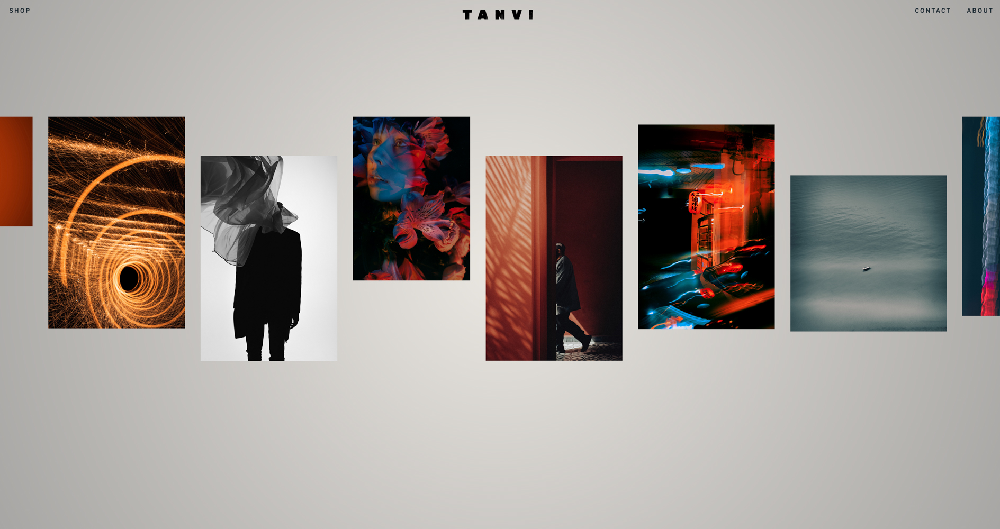

# Photography Portfolio

A responsive landing page of a fictional photography porfolio

## Table of contents

- [Overview](#overview)
  - [Screenshot](#screenshot)
  - [Links](#links)
- [My process](#my-process)
  - [Built with](#built-with)
  - [What I learned](#what-i-learned)
  - [Continued development](#continued-development)
- [Author](#author)

## Overview

### Screenshot



### Links

- Live Site URL: [https://tanvi-1432.github.io/Photography-Portfolio/](https://tanvi-1432.github.io/Photography-Portfolio/)

## My process

### Built with

- Semantic HTML5 markup
- CSS
- Flexbox
- JavaScript

### What I learned

While working on this project, I learned a lot about web development and software engineering. Here are some of the key takeaways:
 - Technical skills: I learned how to make an infinite loop animation of a stack of images. I learned how to make a hamburger menu and improved a lot in text hover animations. Also got a lot more confident with using @media-queries.
 - Personal growth: Overall, this project was a great learning experience for me, and I feel much more confident as a web developer and software engineer. I gained a deeper understanding of how web applications work and how to build them from scratch.

```css
.gallary picture {
  animation: slider 50s linear infinite;
}

@keyframes slider {
  0% {
    transform: translateX(0);
  }

  100% {
    transform: translateX(-4930px);
  }
}
```
```js
hamburger.addEventListener('click', function() {
    mobileNavigation.classList.toggle('active');

});
```

### Continued development

I wanna do more research on how to pause the images infinite loop on hover without breaking the loop animation. And get more proficient using animation in general.

## Author

- linkedin - [Tanvi Chowdhury](https://www.linkedin.com/in/tanvi-chowdhury-244885271/)